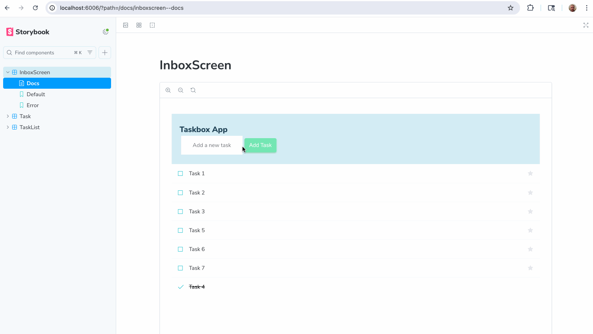

# Storybox - Component-Driven Development with Storybook



A comprehensive demonstration of **Component-Driven Development (CDD)** using Storybook, showcasing modern React development practices with accessibility-first design, comprehensive testing, and cross-browser compatibility.

## 🎯 Project Overview

This project demonstrates the power of **Component-Driven Development** by building a task management application from the ground up using isolated, tested, and documented components. It showcases how Storybook enables teams to build robust UIs with confidence.

### What This Project Demonstrates

**🧩 Component-Driven Development (CDD)**

- Build components in isolation before integrating into pages
- Develop UI components outside the context of business logic
- Create a comprehensive component library with documentation
- Enable parallel development between frontend and backend teams

**♿ Accessibility-First Development**

- Built-in accessibility testing with Storybook's a11y addon
- ARIA labels and semantic HTML structure
- Keyboard navigation support
- Screen reader compatibility
- Color contrast validation

**🔧 Modern Development Practices**

- TypeScript for type safety and better developer experience
- Redux Toolkit for predictable state management
- Mock Service Worker (MSW) for API mocking and testing
- Cross-browser compatibility (Chrome, Safari, Firefox)
- Comprehensive testing strategies

## � Features Implemented

### Core Components

- **Task Component**: Individual task items with state management (inbox, pinned, archived)
- **TaskList Component**: Collection of tasks with loading and empty states
- **InboxScreen Component**: Full page component integrating Redux store and API calls

### Storybook Integration

- **Comprehensive Stories**: Each component has multiple stories showcasing different states
- **Interactive Controls**: Storybook controls for dynamic component testing
- **Documentation**: Auto-generated docs with component props and usage examples
- **Accessibility Testing**: Built-in a11y addon for accessibility validation

### Advanced Features

- **Mock Service Worker (MSW)**: API mocking for development and testing
- **Redux Integration**: State management with Redux Toolkit
- **TypeScript**: Full type safety across the application
- **Cross-browser Support**: Tested and working in Chrome, Safari, and Firefox
- **Responsive Design**: Components work across different screen sizes

## � Prerequisites

This project uses **Yarn 4.5.0** as the package manager, managed through **Corepack** (the recommended approach for modern Yarn).

### Install Yarn 4.5.0 using Corepack

**Prerequisites:** Node.js 16.10+ (Corepack is included with Node.js)

**1. Enable Corepack (if not already enabled):**

```bash
corepack enable
```

**2. The project will automatically use Yarn 4.5.0** when you run yarn commands (configured in `package.json`)

**If Corepack is not available on your system:**

**macOS/Linux:**

```bash
# Update Node.js to 16.10+ (includes Corepack)
# Using nvm (recommended)
nvm install --lts
nvm use --lts

# Or install Corepack separately if needed
npm install -g corepack
corepack enable
```

**Windows:**

```bash
# Update Node.js to 16.10+ from nodejs.org
# Or install Corepack separately if needed
npm install -g corepack
corepack enable
```

**Why Corepack?**

- **Automatic version management**: No need to manually install/update Yarn
- **Project-specific versions**: Each project uses its specified Yarn version
- **Zero global installs**: Yarn is managed per-project
- **Official recommendation**: This is the modern way to use Yarn v4+

**Learn more:** [Corepack Documentation](https://nodejs.org/api/corepack.html)

## 🚅 Quick start

1.  **Clone the repository**

    ```shell
    git clone https://github.com/votoznotna/storybox.git
    cd storybox
    ```

1.  **Install dependencies**

    Navigate into your new site’s directory and install the necessary dependencies.

    ```shell
    yarn install
    ```

1.  **Start the development server**

    ```shell
    # Start the main application
    yarn dev
    ```

1.  **Browse your stories!**

    Run `yarn storybook` to see your component's stories at `http://localhost:6006`

1.  **View your application**
    - Main app: `http://localhost:5173`
    - Storybook: `http://localhost:6006`

## 🎯 Component-Driven Development Benefits

### Why CDD with Storybook?

**🔧 Isolated Development**

- Build components in isolation without worrying about app-specific dependencies
- Focus on component API design and reusability
- Catch edge cases early by testing components in various states

**📚 Living Documentation**

- Auto-generated documentation that stays in sync with code
- Interactive examples that designers and stakeholders can review
- Component API documentation with TypeScript integration

**🧪 Enhanced Testing**

- Visual regression testing capabilities
- Accessibility testing built into the development workflow
- Easy testing of component states and edge cases

**👥 Team Collaboration**

- Shared component library that entire team can reference
- Design system consistency across the application
- Parallel development between frontend and backend teams

## ♿ Accessibility-First Development

### Built-in Accessibility Features

**🔍 Automated Testing**

- Storybook a11y addon automatically checks for accessibility violations
- Real-time feedback during development
- WCAG 2.1 compliance validation

**⌨️ Keyboard Navigation**

- Full keyboard accessibility for all interactive elements
- Proper focus management and tab order
- Screen reader compatibility

**🎨 Visual Accessibility**

- Color contrast validation
- Support for high contrast modes
- Scalable text and responsive design

**🏷️ Semantic HTML**

- Proper ARIA labels and roles
- Semantic HTML structure
- Meaningful alt text for images

### Accessibility Testing Workflow

1. **Development**: a11y addon provides real-time feedback
2. **Review**: Accessibility violations are highlighted in Storybook
3. **Testing**: Manual testing with screen readers and keyboard navigation
4. **Documentation**: Accessibility considerations documented in stories

## 🔎 What's inside?

A quick look at the top-level files and directories included with this template.

    .
    ├── .storybook
    ├── .yarn
    ├── node_modules
    ├── public
    ├── src
    ├── .eslintrc.cjs
    ├── .gitignore
    ├── .yarnrc.yml
    ├── index.html
    ├── LICENSE
    ├── package.json
    ├── tsconfig.app.json
    ├── tsconfig.json
    ├── tsconfig.node.json
    ├── yarn.lock
    ├── vite.config.js
    └── README.md

1.  **`.storybook`**: This directory contains Storybook's [configuration](https://storybook.js.org/docs/configure) files.

2.  **`.yarn`**: This directory contains the configuration files for Yarn including the cache and the global packages.

3.  **`node_modules`**: This directory contains all of the modules of code that your project depends on (npm packages).

4.  **`public`**: This directory will contain the development and production build of the site.

5.  **`src`**: This directory will contain all of the code related to what you will see on your application.

6.  **`eslintrc.cjs`**: This file is the configuration file for [ESLint](https://eslint.org/).

7.  **`.gitignore`**: This file tells git which files it should not track or maintain during the development process of your project.

8.  **`.yarnrc.yml`**: This file contains the configuration for Yarn. It's used to define the project's settings, such as caching and other settings.

9.  **`index.html`**: This is the HTML page that is served when generating a development or production build.

10. **`LICENSE`**: The template is licensed under the MIT licence.

11. **`package.json`**: Standard manifest file for Node.js projects, which typically includes project specific metadata (such as the project's name, the author among other information). It's based on this file that npm will know which packages are necessary to the project.

12. **`tsconfig.app.json`**: This file contains the TypeScript compiler options for the project.

13. **`tsconfig.json`**: This file is the root TypeScript configuration file that specifies the root files and the compiler options required to compile the project.

14. **`tsconfig.json`**: This file is the root TypeScript configuration file that specifies the root files and the compiler options that could be extended by other configuration files in the project.

15. **`tsconfig.node.json`**: This file contains the TypeScript compiler options required to manage the Node.js environment in the project configuration files. Used to help distinguish between configurations for different parts of the project.

16. **`vite.config.js`**: This is the configuration file for [Vite](https://vitejs.dev/), a build tool that aims to provide a faster and leaner development experience for modern web projects.

17. **`yarn.lock`**: This is an automatically generated file based on the exact versions of your npm dependencies that were installed for your project. **(Do not change it manually).**

18. **`README.md`**: A text file containing useful reference information about the project.

## Contribute

If you encounter an issue with the template, we encourage you to open an issue in this template's repository.

## 🛠️ Development Scripts

```bash
# Start development server
yarn dev

# Launch Storybook
yarn storybook

# Build for production
yarn build

# Build Storybook for deployment
yarn build-storybook

# Run tests
yarn test-storybook

# Initialize MSW (if needed)
yarn init-msw
```

## 🧪 Testing Strategy

This project demonstrates multiple testing approaches:

- **Visual Testing**: Storybook stories serve as visual tests
- **Accessibility Testing**: Built-in a11y addon catches accessibility issues
- **Interaction Testing**: Storybook interactions test user workflows
- **API Mocking**: MSW provides consistent API responses for testing

## 📚 Learning Resources

### Component-Driven Development

1. [Component-Driven Development](https://www.componentdriven.org/) - Official CDD methodology
2. [Storybook Tutorial](https://storybook.js.org/tutorials/intro-to-storybook/react/en/get-started/) - Learn Storybook fundamentals
3. [Design Systems for Developers](https://storybook.js.org/tutorials/design-systems-for-developers/) - Building design systems

### Accessibility

1. [Web Content Accessibility Guidelines (WCAG)](https://www.w3.org/WAI/WCAG21/quickref/) - Accessibility standards
2. [Storybook a11y addon](https://storybook.js.org/addons/@storybook/addon-a11y) - Accessibility testing in Storybook
3. [WebAIM](https://webaim.org/) - Web accessibility resources

### Modern React Development

1. [Redux Toolkit](https://redux-toolkit.js.org/) - Modern Redux patterns
2. [Mock Service Worker](https://mswjs.io/) - API mocking for development and testing
3. [TypeScript](https://www.typescriptlang.org/) - Type safety in JavaScript

## 🤝 Contributing

This project serves as a demonstration of best practices. Feel free to:

- Explore the component stories in Storybook
- Examine the accessibility features and testing
- Study the MSW integration for API mocking
- Review the TypeScript implementation
- Understand the Redux Toolkit patterns

## 📄 License

This project is licensed under the MIT License - see the original template license for details.
